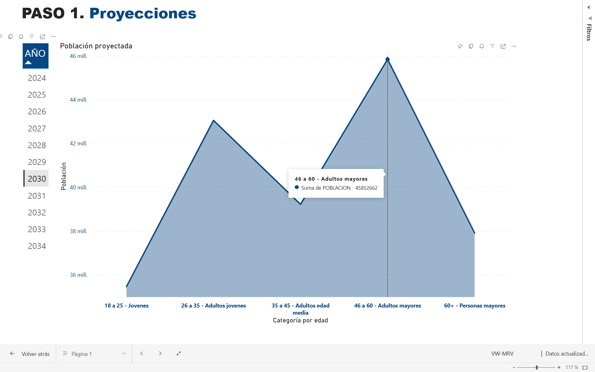

# Dashboard en Power BI: Análisis de Ventas
Este proyecto muestra un dashboard interactivo creado en Power BI para mostrar un proceso eficiente del procesado de la información y garantizar el éxito en ventas.

## ¿Qué contiene?

- Métricas clave: Población proyectada hasta el 2034, pruebas de hipótesis, factores a considerar.
- Filtros interactivos por año.
- Visualizaciones dinámicas.

## Vista previa

## Descargar el archivo `.pbix`

Se puede descargar el archivo desde el siguiente enlace:

[Clic aquí para abrir el archivo](https://www.dropbox.com/scl/fi/4hqccd7zc6a31aos9hokf/VW-MRV.pbix?rlkey=tkh3kngbnkaml6lfrdxlslgxm&st=2lquub70&dl=0)

> *Nota: se necesita tener Power BI Desktop instalado para abrir el archivo.*

## Autor

Minnely Rosales – [LinkedIn](https://linkedin.com/in/minnelyrosales)
